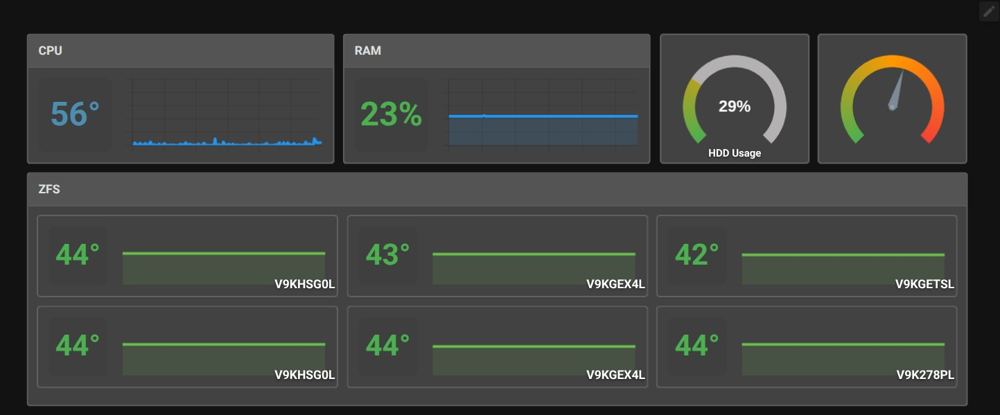
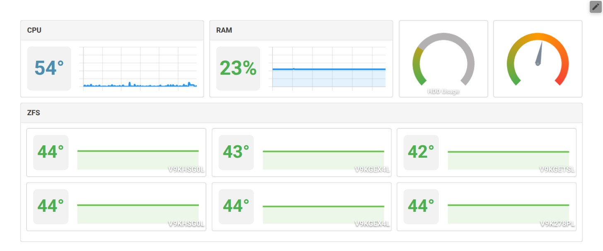
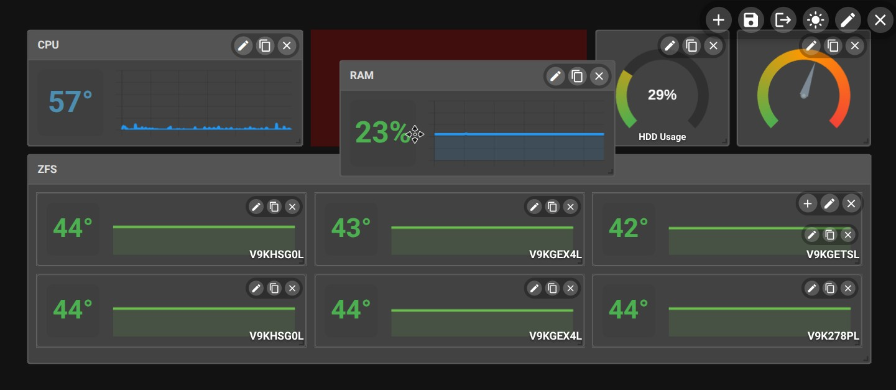
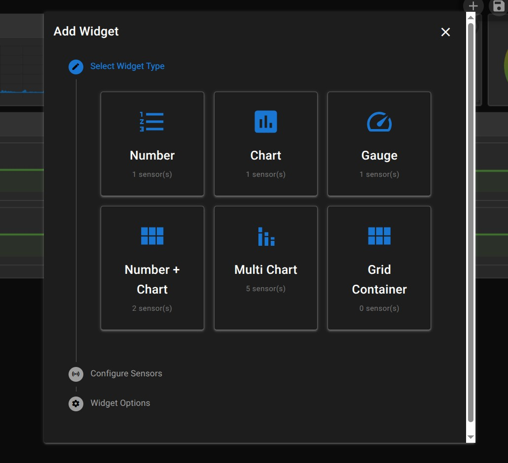
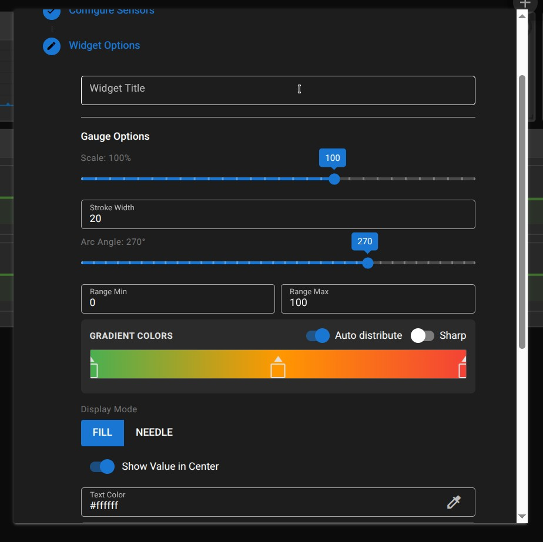

# Simple Monitor

Simple Monitoring System 

- Fully configured Dashboard
- Interactively customizable widgets
- Realtime update
- Auto resample raw metrics to minute\hourly\daily\history period
- Multiple hosts supported
- Allowed mix any sensors in single widget

#### Examples

NAS dashboard

Light Theme

Edit mode

Add widget

TODO:
- alerting
- customize widget style
- mode special widgets
- multiple dashboards supporting
